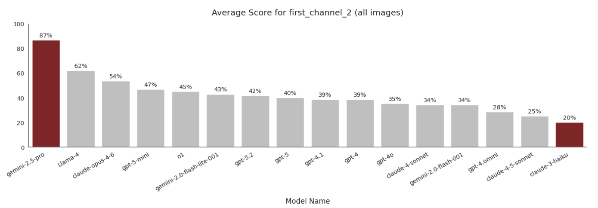

---
date:
  created: 2026-05-19
categories:
    - LLM
authors:
    - ltdarc
subtitle: 
---
# LLM Benchmarks for Researchers

For social science and business research, the most valuable data is often locked inside dense, scanned documents like financial filings, census tables, and newspaper pages. Digitizing these sources has traditionally meant slow, manual transcription, often handed to students or outsourced labor to copy out cell by cell.

While Large Language Models (LLMs) offer a powerful alternative to manual data extraction, implementing them at scale introduces a new set of challenges.

For researchers, this raises a more fundamental question: how do you know a model is reliable enough for your specific documents and research question? Strong results on one example aren't enough. You need a structured way to measure whether a model performs consistently before building any analysis on its output.

<!-- more -->

!!! note
    This article will cover how to design LLM benchmarks for research related data extraction and provide examples from our own implementation. For additional context you can reference our [Hub How-To](https://gsbresearchhub.stanford.edu/training-workshops){target="_blank"}  and our GitHub [here](https://github.com/gsbdarc/LLM_benchmarks){target="_blank"}.

## Our Data

Throughout this article we'll use one running example: historical newspaper pages containing printed **TV listings** — dense, grid-shaped program schedules. We chose them as a stand-in for other tabular historical documents (census records, financial ledgers, and the like) because they share the hard parts: small fonts, mixed scan quality, and layouts that shift from one paper to the next.

<figure markdown>
  { width="700" }
  <figcaption>A historical newspaper page with a printed TV-listings grid.</figcaption>
</figure>

## Designing Benchmarks

### Why You Need a Benchmark

A model might perform perfectly on a single document but still fail across your full dataset due to variability in layout, font size, and resolution. You need a benchmark: a standardized measure of how different LLMs perform specific tasks across a representative sample of your data.

For our LLM evaluation pipeline, one benchmark asked the model to extract the newspaper name from the fixed header — the masthead metadata printed in the same spot on every page — a straightforward task with a consistent, verifiable answer. A harder benchmark asked for the first program listed in the TV-listings grid, requiring the model to read small, low-resolution text with significant variability across documents. Covering a range of difficulty reveals not just whether a model performs well on average, but where it starts to break down.

By establishing fixed criteria, a benchmark allows researchers to:

- **Navigate Tradeoffs**: Systematically balance budget constraints against accuracy requirements.
- **Remove Bias**: Guarantee objective, reproducible results rather than relying on a few lucky outputs.
- **Track Progress**: Confidently measure whether a prompt tweak or model switch actually improves performance or causes a regression.

### Evaluation Framework

Popular LLM benchmarks like [MMLU](https://arxiv.org/abs/2009.03300){target="_blank"} or [BIG-Bench](https://arxiv.org/abs/2206.04615){target="_blank"} compare models at a high level, but they don't tell you whether a model can handle your specific documents or research question. For data extraction, you need to design your own.

The framework I used has four components; in a well-designed benchmark, each follows from the last.

<figure markdown>
  { width="700" }
  <figcaption>The four component framework used in our benchmark design.</figcaption>
</figure>

**Research Question**

The research question anchors the entire framework. Everything downstream (what you extract, how you prompt, how you score) should trace back to it.

!!! example "In our pipeline"
    *How did historical TV programming vary across channels and time periods?*

**Task**

A task translates the research question into a concrete extraction operation. One research question may require several tasks; each should be narrow enough to prompt clearly and score objectively.

!!! example "In our pipeline"
    Extract the show title of the first program listed in the TV-listings grid for the earliest time slot shown — a consistent, well-defined data point present on every newspaper page.

**Prompt**

The prompt translates the task into explicit, machine-readable instructions. Precision matters: a vague prompt doesn't just produce inconsistent outputs, it makes it harder to diagnose whether poor results reflect a model limitation or an underspecified instruction.

!!! example "In our pipeline"
    The prompt needed to specify where in the grid to look and exactly what to return. See [Updating Prompts](#updating-prompts) for how it evolved across three iterations.

**Metric**

The metric defines what counts as a correct answer, and the choice has real consequences for how you interpret results.

!!! example "In our pipeline"
    We scored each model response against the **ground truth** — the verified, hand-transcribed correct answer for each image. For the *first program* task, the ground truth was the show **title** only: the show name stripped of episode descriptions, closed-captioning markers, and VCR codes. (See [Challenges with Ground Truth](#challenges-with-ground-truth) for a concrete example of how ambiguous this can be in practice.)

    We started with exact string matching, then pivoted to fuzzy matching (Levenshtein similarity ratio) to better handle minor transcription differences — small capitalization or punctuation variations were acceptable, but exact match was penalizing outputs that were substantively correct.

**The Feedback Loop**

In practice, this framework is iterative, not linear. Poor scores are a diagnostic signal, not just a verdict on the model. Trace back through the framework to find where alignment broke down:

- Are your tasks reflective of your research question and the data you have to work with?
- Does your prompt properly explain what you want the LLM to do?
- Is your metric appropriate for what the prompt is actually asking?

In our pipeline, a one-sentence prompt returned poor results; iterating on it significantly improved performance across models. At the scale of this project (18 models, 35 images, 6 benchmarks), that's nearly 3,800 task combinations per iteration — a reusable pipeline turns each prompt change into a configuration update rather than a full re-run.

### Executing at Scale

To handle this scale efficiently, we built the following pipeline:

<figure markdown>
  { width="700" }
  <figcaption>The end-to-end evaluation pipeline used in our project.</figcaption>
</figure>

After configuring our inputs (benchmarks, models, and images) and preprocessing images (converting PDFs to greyscale PNGs) we accessed models through the [Stanford Playground API](https://uit.stanford.edu/aiplayground){target="_blank"}. Outputs and benchmark evaluation results were stored in [MongoDB](https://www.mongodb.com){target="_blank"}, our centralized database. 

Storing results means you can compare across runs: did the new prompt do better or worse than the last version? Did switching models cause a regression on a benchmark that was previously working? Without it, there is no easy way to answer those questions without re-running everything from scratch. 

We processed all tasks in a few hours using the [Yen](https://rcpedia.stanford.edu/_getting_started/how_access_yens/?h=yens){target="_blank"} servers  for compute and [SLURM](https://rcpedia.stanford.edu/_user_guide/slurm/?h=slurm){target="_blank"} array jobs to process tasks in parallel.

!!! note "Stanford AI Playground"
    We used the Stanford AI Playground because it gave us access to multiple multimodal models through a single Stanford managed API. The playground is approved for [high risk](https://uit.stanford.edu/news/stanford-ai-playground-now-approved-high-risk-data){target="_blank"} data. Stanford provides access through a Stanford-managed environment with vendor agreements covering data use, retention, and model training; data is not used to train vendor models.

    You will need to apply and get approval for an [API](https://uit.stanford.edu/service/ai-api-gateway){target="_blank"} key.

    Note: models are continuously deprecated and added to the Playground. You must reapply for a new key each time this occurs in order to keep your access up to date.

## In Practice: Iterating on Historical TV Guides

As part of my intern project, I applied this framework to evaluate LLM performance on historical TV guides — dense, grid-based documents with mixed scan quality that make a useful proxy for other tabular historical sources.

<figure markdown>
  { width="700" }
  <figcaption>Example newspaper pages with TV-listings grids from our dataset.</figcaption>
</figure>

### Selecting Benchmarks

We selected tasks with clear, verifiable answers and assigned each a difficulty level based on expected extraction challenge — a prediction our results later confirmed. We started with six benchmarks:

<figure markdown>
  { width="700" }
  <figcaption>Sample page from our dataset showing the newspaper header and TV-listings grid.</figcaption>
</figure>

<figure markdown>
  { width="700" }
  <figcaption>A second sample page illustrating layout variability across the dataset.</figcaption>
</figure>

=== "Easy (Grey)"

    | Task | Description |
    |---|---|
    | Newspaper Name | Simple metadata extraction, fixed location across documents, high resolution. |
    | Newspaper Date | Simple metadata extraction, fixed location across documents, high resolution. |

=== "Medium (Yellow) "

    | Task | Description |
    |---|---|
    | TV Guide Day of Week | Varied location, mixed resolution, data found in scanned PDF. |
    | TV Guide Date | Reasoning: answer is derived by combining both Newspaper Date and TV Guide Day of Week without being explicitly prompted. |

=== "Hard (Red)"

    | Task | Description |
    |---|---|
    | First Channel | Data found within grid, smallest font, lowest resolution, variability (color, placement, size). |
    | First Program | Data found within grid, smallest font, lowest resolution, variability (color, placement, size). |

### Challenges with "Ground Truth"

Defining ground truth (the correct answer you score an LLM output against) is harder than it sounds. In our dataset, what counted as the right answer depended heavily on the specific research question and the variability in the data itself.

<figure markdown>
  { width="700" }
  <figcaption>A row from a TV-listings grid showing the 2015 Daytona 500 entry.</figcaption>
</figure>

To better illustrate this challenge, when asking an LLM to extract the "first program" from the above, what is the correct answer?

- **A.** 2015 Daytona 500 The 57th running of the event. The race consists of 200 laps and is the first race of the season. (N) (cc)
- **B.** 2015 Daytona 500 The 57th running of the event. The race consists of 200 laps and is the first race of the season.
- **C.** 2015 Daytona 500

The so called "right" answer depends on whether the research question cares about close captioning, episode descriptions, or just the title.

!!! tip
    Hand transcribing 5 to 10 images yourself can be enormously helpful in understanding the data that is available and how much variability you might be dealing with.

### Updating Prompts

With ground truth defined, our scores became the signal for iteration. One benchmark that models initially struggled with was extracting the first program name — the hardest task in the set, with small font, low resolution, and significant variability across guides.

We used our metrics as a signal and adjusted our prompt several times to see if we could get better results. You can see the prompts we used below and how each model performed across all images.

=== "First Program v1"
    **Short, one sentence prompt.**

    Return the name of the program for the first channel listed and for the earliest time slot shown.

    <figure markdown>
      { width="700" }
      <figcaption>Average first_program score per model using Prompt v1.</figcaption>
    </figure>
=== "First Program v2"
    **Added explicit grid structure and step-by-step navigation instructions.**

    Analyze the provided image of a TV schedule grid. Channels are typically listed vertically (rows) and time slots horizontally (columns). Your task is to extract the program title for the FIRST channel listed at the EARLIEST time slot shown. Follow these steps carefully: 1. Scan the grid to identify the top-most row containing programming data (the row immediately below the time-slot or any other subsection headers). 2. Scan to the left-most time block within that specific row. 3. Identify the text inside this top-leftmost program block. 4. Transcribe the text exactly as printed. Include all numbers (e.g., episode numbers, parts, movie years), abbreviations, and characters that appear immediately with the title.

    <figure markdown>
      { width="700" }
      <figcaption>Average first_program score per model using Prompt v2.</figcaption>
    </figure>

    !!! note "Why did GPT-5 score 0%?"
        Under fuzzy matching, even a hallucination produces some character overlap and scores above zero — so exactly 0% means the model returned null rather than any answer at all. On this prompt version, gpt-5 and gpt-5-mini consistently abstained when the target text was too small or low-resolution to read confidently, rather than attempt an uncertain extraction.

        
=== "First Program v3"
    **Narrowed the output to the title only, filtering out metadata like captions and codes.**

    Analyze the provided image of a TV schedule grid. Channels are typically listed vertically (rows) and time slots horizontally (columns). Your task is to extract the program title for the FIRST channel listed at the EARLIEST time slot shown. Follow these steps carefully: 1. Scan the grid to identify the top-most row containing programming data (the row immediately below the time-slot or any other subsection headers). 2. Scan to the left-most time block within that specific row. 3. Identify the text inside this top-leftmost program block. 4. Return only the title, ignore all closed captioning markers, rerun indicators, movie release years, or VCR Plus+ codes (numeric sequences) that appear immediately with the title.

    <figure markdown>
      { width="700" }
      <figcaption>Average first_program score per model using Prompt v3.</figcaption>
    </figure>

### Results

Across all benchmarks and models, scores followed the difficulty gradient we predicted before running — confirming the task labels were well-calibrated.

<figure markdown>
  { width="700" }
  <figcaption>Average accuracy by benchmark across all models and images.</figcaption>
</figure>

Easy metadata tasks (newspaper name and date) scored above 94% on average. The hard grid-reading tasks — first channel and first program — averaged 26% and 20% respectively, reflecting the real challenges of small fonts and low scan resolution.

The first program results shown above cover one benchmark across all models. First channel — a comparable task, asking for the channel identifier in the leftmost grid column — showed the same pattern:

<figure markdown>
  { width="700" }
  <figcaption>Average first_channel score per model across all images.</figcaption>
</figure>

Gemini-2.5-pro led with 87%, while the rest of the field clustered between 20–62%.

Looking across all six benchmarks, the overall model leaderboard — accuracy averaged across all tasks — was:

<figure markdown>
  { width="700" }
  <figcaption>Top-8 and bottom-8 models ranked by overall accuracy, with total cost per model.</figcaption>
</figure>

Gemini-2.5-pro topped the leaderboard at 71.9% overall. Notably, high accuracy didn't require high cost: Llama-4 reached 64.6% at $1.36, and gemini-2.0-flash-001 hit 63.3% at just $0.33 — both competitive with models costing 10–100x more.

### Cost

One practical question for any researcher considering this approach: how much does it actually cost to run?

<figure markdown>
  { width="700" }
  <figcaption>Best-performing model per benchmark, with accuracy and total cost.</figcaption>
</figure>

For easy benchmarks, the best-performing model cost as little as $0.03–$0.06 across all 35 images and still hit 100% accuracy. Hard tasks cost more: the top model for first program (gemini-2.5-pro) cost $1.23 for the same 35 images, at 43.8% accuracy — a reminder that higher cost doesn't guarantee better results on difficult extraction tasks.

Looking at total cost across all six benchmarks (shown in the leaderboard above), per-model spend ranged from $0.15 to $41.35. The expensive end didn't buy better results: o1 cost $41.35 and ranked 6th at 61.0%, well behind models costing a fraction as much.

!!! note "Estimating your own run"
    These figures cover one model across all 35 images and 6 benchmarks. To estimate costs for your project: multiply your image count by the per-image rate for your chosen model, then by the number of benchmarks you plan to run. A small pilot of 10 images and 3 models costs roughly the same as one row in this table — an inexpensive way to calibrate before committing to a full run.

### Reasoning Models and Temperature

We set `temperature=0` for all models to keep extraction deterministic — the same prompt on the same image should produce the same output every time, making results auditable and re-runnable. Some models also support a **reasoning effort** parameter that controls how much internal chain-of-thought the model performs before responding; however, this setting is not consistently available across all models in the Stanford Playground, so we used each model's default.

One benchmark where reasoning capability genuinely mattered was **TV Guide Date**: unlike the other tasks, the correct date isn't printed explicitly anywhere in the grid — the model must derive it by combining the newspaper's publication date (from the fixed header) with the day-of-week label in the TV listings. Tasks like this, which require inference rather than direct transcription, are where tuning reasoning effort — or choosing a reasoning-optimized model — is most likely to pay off.

## Takeaways

1. **Speed and Ease**

    The pipeline design allowed us to easily add new models, benchmarks, or images. It processed tasks in parallel, stored results in a database, and calculated metrics dynamically. This framework can be adapted by any researcher looking to evaluate LLMs for structured document extraction.

2. **Quality of results**

    Above anything else, good results came from a well-defined research question and a solid understanding of the variability and outliers in our data. Only from there could we create tasks, build prompts, and choose the right metrics.

