---
date:
  created: 2026-05-19
categories:
    - LLM
authors:
    - ltdarc
subtitle: 
---
# LLM Benchmarks for Researchers

For social science and business research, the most valuable data is often locked inside dense, scanned documents like financial filings, census tables, and newspaper pages. Digitizing these sources has traditionally meant slow, manual transcription, often handed to students or outsourced labor to copy out cell by cell.

Large Language Models (LLMs) offer a powerful alternative to manual data extraction, but using them for research raises a more fundamental question: how do you know a model is reliable enough for your specific documents and research question? Strong results on one example aren't enough. You need a structured way to measure whether a model performs consistently before building any analysis on its output.

<!-- more -->

!!! note
    This article will cover how to design LLM benchmarks for research related data extraction and provide examples from our own implementation. For additional context you can reference our [Hub How-To](https://gsbresearchhub.stanford.edu/training-workshops){target="_blank"} and our [GitHub](https://github.com/gsbdarc/LLM_benchmarks){target="_blank"}.

## Our Data

Throughout this article we'll use one running example: historical newspaper pages containing printed **TV Guides**, dense, grid-shaped program schedules. We chose them as a stand-in for other tabular historical documents (census records, financial ledgers, etc.) because they share the hard parts: small fonts, mixed scan quality, and layouts that shift from one paper to the next.

<figure markdown>
  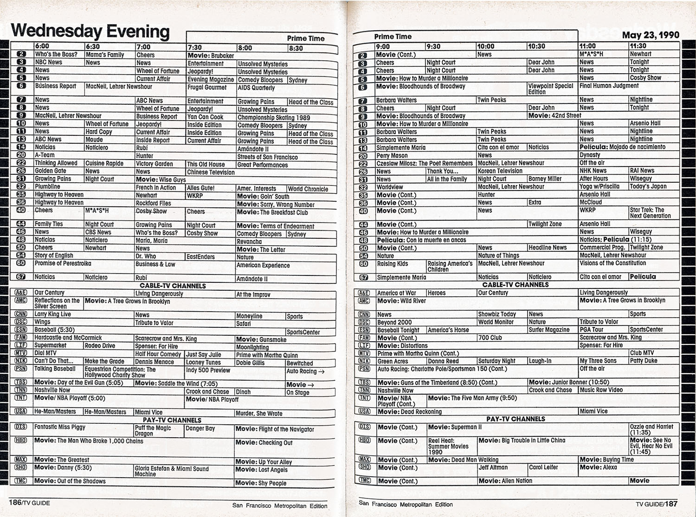{ width="700" }
  <figcaption>A historical newspaper page with a printed TV-listings grid.</figcaption>
</figure>

## Designing Benchmarks

### Why You Need a Benchmark

A model might perform perfectly on a single document but still fail across your full dataset due to variability in layout, font size, and resolution. You need a benchmark: a standardized measure of how different LLMs perform specific tasks across a representative sample of your data.

For our LLM evaluation pipeline, one benchmark asked the model to extract the day of week the TV guide was for: a straightforward task with a consistent, verifiable answer. A harder benchmark asked for the first program listed in the TV-listings grid, requiring the model to read small, low-resolution text with significant variability across documents. Covering a range of difficulty reveals not just whether a model performs well on average, but where it starts to break down.

By establishing fixed criteria, a benchmark allows researchers to:

- **Navigate Tradeoffs**: Systematically balance budget constraints against accuracy requirements.
- **Ensure Reproducibility**: Guarantee objective, reproducible results rather than relying on a few lucky outputs.
- **Track Progress**: Confidently measure whether a prompt tweak or model switch actually improves performance or causes a regression.

### Evaluation Framework

Popular LLM benchmarks like [MMLU](https://arxiv.org/abs/2009.03300){target="_blank"} or [BIG-Bench](https://arxiv.org/abs/2206.04615){target="_blank"} compare models at a high level, but they don't tell you whether a model can handle your specific documents or research question. For data extraction, you need to design your own.

The framework we used has four components; in a well-designed benchmark, each follows from the last.

<figure markdown>
  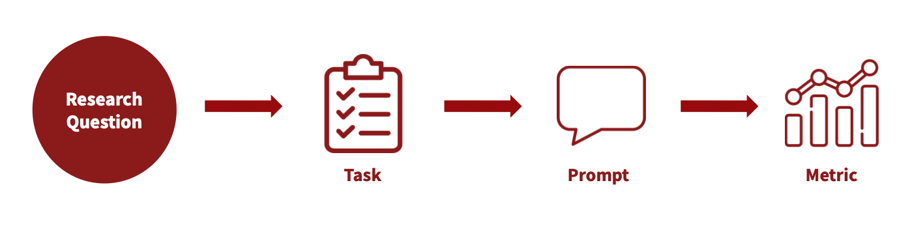{ width="700" }
  <figcaption>The four component framework used in our benchmark design.</figcaption>
</figure>

**Research Question**

The research question anchors the entire framework. Everything downstream (what you extract, how you prompt, how you score) should trace back to it.

!!! example "In our pipeline"
    How did historical TV programming vary across channels and time periods?

**Task**

A task translates the research question into a concrete extraction operation. One research question may require several tasks; each should be narrow enough to prompt clearly and score objectively.

!!! example "In our pipeline"
    Get the name of the first channel from each image.

**Prompt**

The prompt translates the task into explicit, machine-readable instructions. Precision matters: a vague prompt doesn't just produce inconsistent outputs, it makes it harder to diagnose whether poor results reflect a model limitation or an underspecified instruction.

!!! example "In our pipeline"
    Analyze the provided image of a TV schedule grid from a newspaper. Each row represents one channel. The leftmost or rightmost area of each row contains the channel information. Extract the channel information from ONLY the first data row of the grid (the first row immediately after the time-slot or any other subsection headers).

**Metric**

The metric defines what counts as a correct answer and measures how close an output is to the ground truth.

!!! example "In our pipeline"
    LLM Output: "Food Channel"  
    Ground Truth: "Food Network"  
    Metric: word_iou (fraction of common words between two strings)  
    Score: 0.5

**The Feedback Loop**

<figure markdown>
  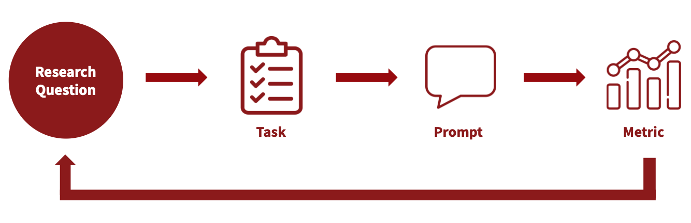{ width="700" }
  <figcaption>The iterative four component benchmark design framework.</figcaption>
</figure>

In practice, this framework is iterative, not linear. Poor scores are a diagnostic signal, not just a verdict on the model. Trace back through the framework to find where alignment broke down:

- Are your tasks reflective of your research question and the data you have to work with?
- Does your prompt properly explain what you want the LLM to do?
- Is your metric appropriate for what the prompt is actually asking?

In our pipeline, a one-sentence prompt returned poor results; iterating on it significantly improved performance across models.

### Executing at Scale

Our project scaled quickly (18 models, 35 images, 6 benchmarks) with nearly 3,800 task combinations per iteration. To handle this volume efficiently, we built the following pipeline:

<figure markdown>
  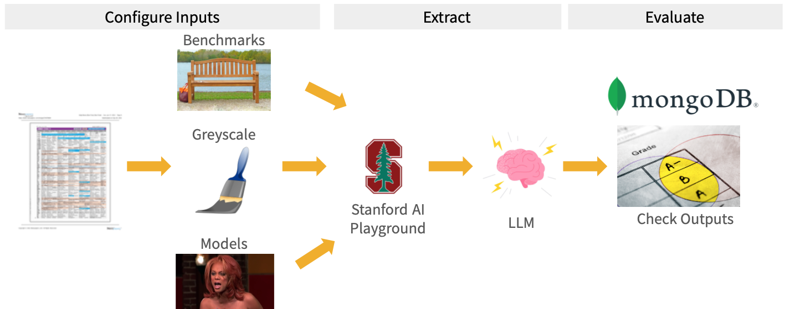{ width="700" }
  <figcaption>The end-to-end evaluation pipeline used in our project.</figcaption>
</figure>

After configuring our inputs (benchmarks, models, and images) and converting PDFs to greyscale PNGs, we accessed models through the [Stanford Playground AI API](https://rcpedia.stanford.edu/blog/2026/03/06/stanfords-llm-api-tools/){target="_blank"}. Stanford provides access through a Stanford-managed environment with vendor agreements covering data use, retention, and model training; data is not used to train vendor models. The API allowed us to get outputs from models without the need for a web interface.

!!! note "Stanford AI Playground"
    Note: models are continuously deprecated and added to the Playground. You must reapply for a new key each time the list of available models changes in order to keep your access up to date.

Outputs and benchmark evaluation results were stored in [MongoDB](https://www.mongodb.com){target="_blank"}, our centralized database with the following schema:

| Field | Type | Example | Notes |
| --- | --- | --- | --- |
| `_id` | string | `"3023_2_processed"` | Primary key that captures the task ID and run ID of a successful LLM output |
| `benchmark_id` | string | `"2"` | Unique integer identifier for the prompt |
| `benchmark_name` | string | `"newspaper_date"` | Unique name identifier for the prompt |
| `completion_tokens` | integer | `15` | Token usage associated with the LLM output |
| `error` | string | `null` | Error message if the LLM was not able to return an output |
| `image_id` | string | `"1"` | Unique integer identifier for the image used |
| `model_id` | string | `"1"` | Unique integer identifier for the LLM |
| `model_name` | string | `"Llama-4"` | Unique name identifier for the LLM |
| `output_name` | string | `"Sun, Nov 16, 1997"` | Output from the LLM |
| `run_id` | integer | `1` | The ith iteration of a given task |
| `status` | string | `"processed"` | `processed` if the LLM returned an output without error, otherwise `unprocessed` |
| `task_id` | string | `"2416"` | Unique ID associated with the combination of benchmark, image, and model |
| `total_tokens` | integer | `4000` | Token usage associated with the input prompt and LLM output |
| `updated_at` | datetime | `2026-04-08 15:45:50` | Time when the LLM returned an output |

Storing results means you can compare across runs: did the new prompt do better or worse than the last version? Did switching models cause a regression on a benchmark that was previously working? Without it, answering those questions requires re-running everything from scratch.

We processed all tasks in a few hours using the [Yen](https://rcpedia.stanford.edu/_getting_started/how_access_yens/?h=yens){target="_blank"} servers for compute and [SLURM](https://rcpedia.stanford.edu/_user_guide/slurm/?h=slurm){target="_blank"} array jobs to process tasks in parallel.

## In Practice: Iterating on Historical TV Guides

Here's how we applied this framework in practice.

<figure markdown>
  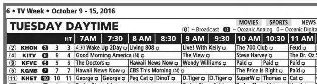{ width="700" }
  <figcaption>Example newspaper pages with TV-listings grids from our dataset.</figcaption>
</figure>

### Selecting Benchmarks

We selected tasks with clear, verifiable answers and assigned each a difficulty level based on expected extraction challenge. We started with six benchmarks:

<figure markdown>
  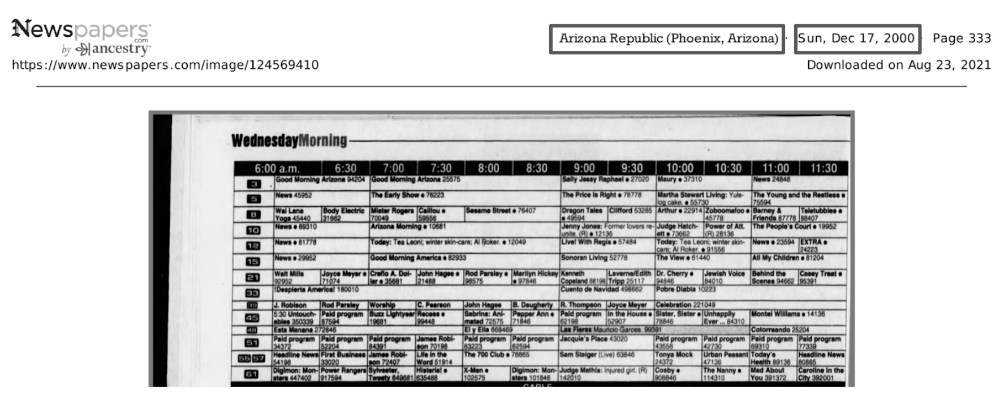{ width="700" }
  <figcaption>Sample page from our dataset showing the newspaper header and TV-listings grid. Easy benchmark answers are in grey boxes.</figcaption>
</figure>

**Easy (Grey)**

  | Task | Description |
  |---|---|
  | Newspaper Name | Simple metadata extraction, fixed location across documents, high resolution. |
  | Newspaper Date | Simple metadata extraction, fixed location across documents, high resolution. |

<figure markdown>
  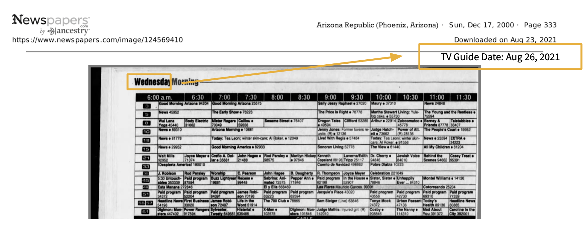{ width="700" }
  <figcaption>Sample page from our dataset showing the newspaper header and TV-listings grid. Medium benchmark answers are in yellow boxes.</figcaption>
</figure>

**Medium (Yellow)**

  | Task | Description |
  |---|---|
  | TV Guide Day of Week | Varied location, mixed resolution, data found in scanned PDF. |
  | TV Guide Date | Reasoning: answer is derived by combining both Newspaper Date and TV Guide Day of Week without being explicitly prompted. |

<figure markdown>
  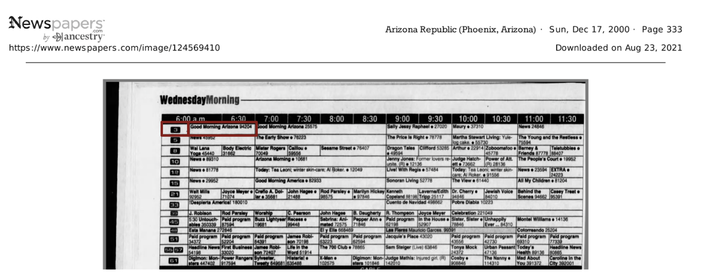{ width="700" }
  <figcaption>Sample page from our dataset showing the newspaper header and TV-listings grid. Hard benchmark answers are in red boxes. </figcaption>
</figure>

**Hard (Red)**

  | Task | Description |
  |---|---|
  | First Channel | Data found within grid, smallest font, lowest resolution, variability (color, placement, size). |
  | First Program | Data found within grid, smallest font, lowest resolution, variability (color, placement, size). |

### Challenges with "Ground Truth"

Defining ground truth (the correct answer you score an LLM output against) is harder than it sounds. In our dataset, what counted as the right answer depended heavily on the specific research question and the variability in the data itself.

<figure markdown>
  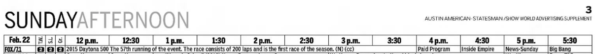{ width="700" }
  <figcaption>A row from a TV-listings grid showing the 2015 Daytona 500 entry.</figcaption>
</figure>

To better illustrate this challenge, when asking an LLM to extract the "first program" from the above, what is the correct answer?

- **A.** 2015 Daytona 500 The 57th running of the event. The race consists of 200 laps and is the first race of the season. (N) (cc)
- **B.** 2015 Daytona 500 The 57th running of the event. The race consists of 200 laps and is the first race of the season.
- **C.** 2015 Daytona 500

The so-called "right" answer depends on what your prompt is actually asking for — and it can change as your prompt evolves. In our pipeline, we maintained separate ground truth sets for each task and prompt version to ensure our metric always matched what we were asking the model to do.

!!! tip
    Hand transcribing 5 to 10 images yourself can be enormously helpful in understanding the data that is available and how much variability you might be dealing with.

### Updating Prompts

With ground truth defined, our scores became the signal for iteration. One benchmark that models initially struggled with was extracting the first program name — the hardest task in the set, with small font, low resolution, and significant variability across guides.

We adjusted our prompt several times to see if we could get better results. You can see the prompts we used below and how each model performed across all images. The model with the best performance across each prompt is highlighted in red.

=== "First Program v1"
    **Short, one sentence prompt.**

    Return the name of the program for the first channel listed and for the earliest time slot shown.

    <figure markdown>
      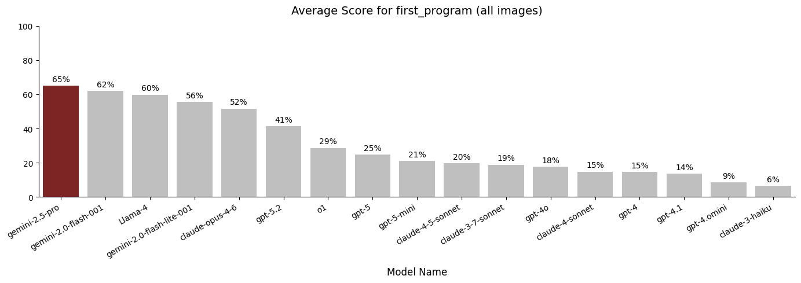{ width="700" }
      <figcaption>Average first_program score per model using Prompt v1.</figcaption>
    </figure>
=== "First Program v2"
    **Added explicit grid structure and step-by-step navigation instructions.**

    Analyze the provided image of a TV schedule grid. Channels are typically listed vertically (rows) and time slots horizontally (columns). Your task is to extract the program title for the FIRST channel listed at the EARLIEST time slot shown. Follow these steps carefully: 1. Scan the grid to identify the top-most row containing programming data (the row immediately below the time-slot or any other subsection headers). 2. Scan to the left-most time block within that specific row. 3. Identify the text inside this top-leftmost program block. 4. Transcribe the text exactly as printed. Include all numbers (e.g., episode numbers, parts, movie years), abbreviations, and characters that appear immediately with the title.

    <figure markdown>
      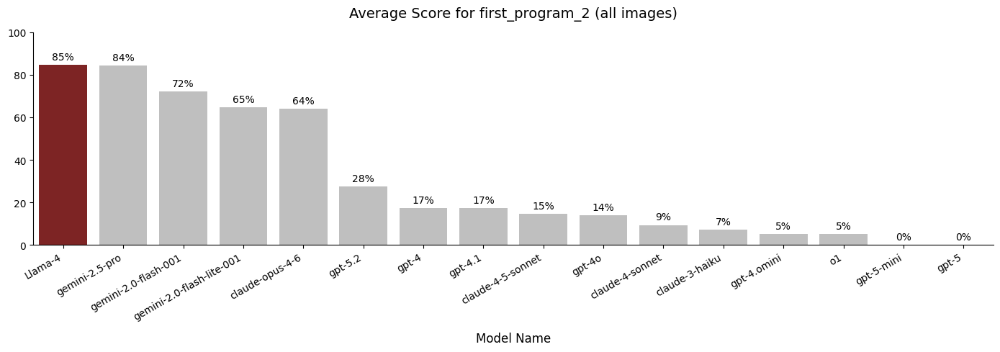{ width="700" }
      <figcaption>Average first_program score per model using Prompt v2.</figcaption>
    </figure>

    !!! note "Why did GPT-5 score 0%?"
        Under fuzzy matching (scoring partial overlap rather than requiring an exact match), even a hallucination produces some character overlap and scores above zero — so exactly 0% means the model returned null rather than any answer at all. On this prompt version, gpt-5 and gpt-5-mini consistently abstained when the target text was too small or low-resolution to read confidently, rather than attempt an uncertain extraction.

        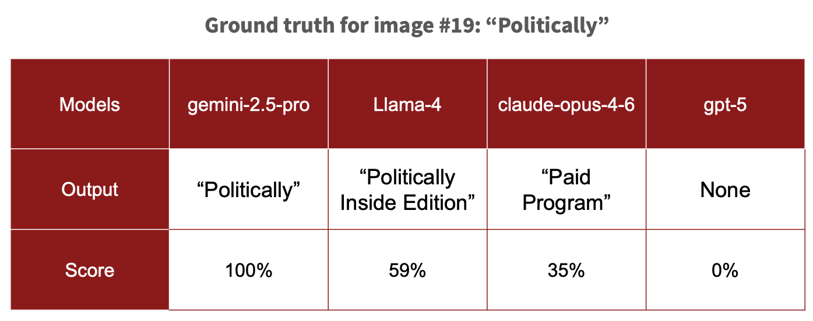
=== "First Program v3"
    **Narrowed the output to the title only, filtering out metadata like captions and codes.**

    Analyze the provided image of a TV schedule grid. Channels are typically listed vertically (rows) and time slots horizontally (columns). Your task is to extract the program title for the FIRST channel listed at the EARLIEST time slot shown. Follow these steps carefully: 1. Scan the grid to identify the top-most row containing programming data (the row immediately below the time-slot or any other subsection headers). 2. Scan to the left-most time block within that specific row. 3. Identify the text inside this top-leftmost program block. 4. Return only the title, ignore all closed captioning markers, rerun indicators, movie release years, or VCR Plus+ codes (numeric sequences) that appear immediately with the title.

    <figure markdown>
      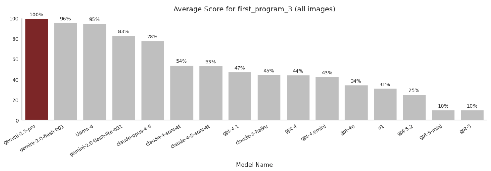{ width="700" }
      <figcaption>Average first_program score per model using Prompt v3.</figcaption>
    </figure>

### Results

=== "Average Accuracy by Benchmark"

    <figure markdown>
      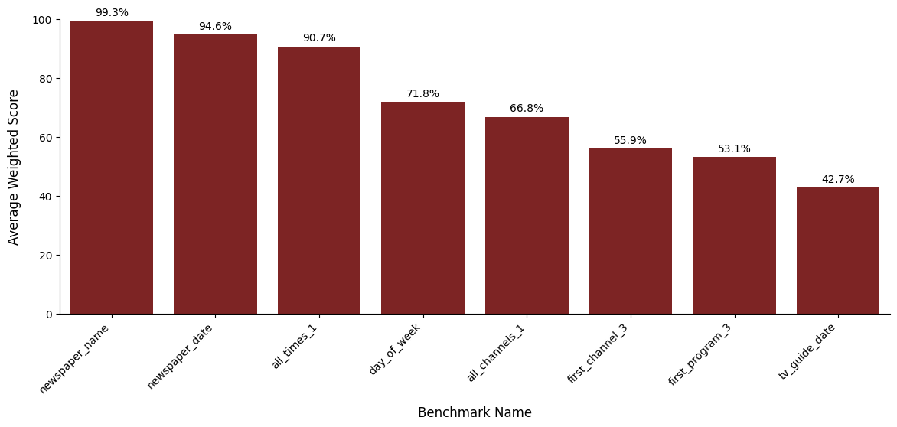{ width="700" }
      <figcaption>Average accuracy by benchmark across all models and images.</figcaption>
    </figure>

    Our best performing benchmarks were easy metadata tasks like newspaper name and newspaper date, which scored 99% and 95% respectively. 

    The worst performing benchmark was TV Guide Date with an overall score of 42.7%. Low scores were indicative of vague prompting and additional complexity from reasoning compared to other data extraction benchmarks.'

    We added additional benchmarks "all times" and "all channels" to evaluate how well the models did on extracting larger arrays of information.

=== "Average Accuracy by Model"
    Looking across all benchmarks, the model leaderboard for accuracy averaged across all tasks was:

    <figure markdown>
      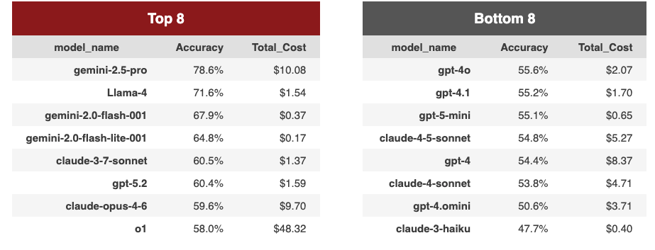{ width="700" }
      <figcaption>Top-8 and bottom-8 models ranked by overall accuracy, with total cost per model.</figcaption>
    </figure>

    Gemini-2.5-pro topped the leaderboard at 78.6% overall while claude-3-haiku could only produce accurate results 48% of the time. Notably, our most expensive model was o1, which cost almost 5x more than gemini-2.5-pro but had an accuracy of 58%.

### Temperature and Reasoning Models

**Accuracy Rates Across Runs**

<figure markdown>
  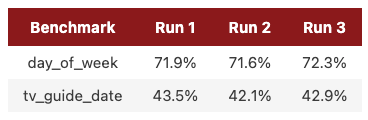{ width="500" }
  <figcaption> Variability across runs for day of week and tv guide date (all models and images).  </figcaption>
</figure>

We set `temperature=0` for all models to keep extraction deterministic (the same prompt on the same image should produce the same output every time). Even after doing so, however, we noticed variation in outputs which was reflected in the accuracy rate per run. To account for this we would recommend running the same task multiple times and taking the average of the metrics.

**Reasoning**

Some models also support a **reasoning effort** parameter that controls how much internal chain-of-thought the model performs before responding; however, this setting is not consistently available across all models in the Stanford Playground, so we used each model's default.

One benchmark where reasoning capability genuinely mattered was **TV Guide Date**: unlike the other tasks, the correct date isn't printed explicitly anywhere in the grid. Instead, the model must derive it by combining the newspaper's publication date (from the fixed header) with the day of week label in the TV guide. Tasks like this, which require inference rather than direct transcription, are where tuning reasoning effort (or choosing a reasoning-optimized model) is most likely to pay off.

### Cost

One practical question for any researcher considering this approach: how much does it actually cost to run?

<figure markdown>
  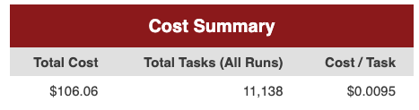{ width="500" }
  <figcaption> Total cost per task across 35 images and 18 models. </figcaption>
</figure>

Running the entire evaluation pipeline multiple times (approx. 11,100 tasks) cost $106.06. We noticed that simple metadata extraction tasks tended to be cheaper ($0.006/task) while more complex tasks that required lengthy prompts, larger outputs, and/or more reasoning drove up costs.

## Takeaways

Building a benchmark was less about finding the one "right" model and more about setting up a process we could keep refining as our questions, data, and the available models change. A few lessons stood out from our work:

1. **Start with your research question**

    Good results depend first on a well-defined research question and a clear understanding of our data's variability. Tasks, prompts, and metrics all follow from there; getting that foundation right is what separates a useful benchmark from one that just produces numbers.

2. **Treat it as an iterative process**

    A benchmark has many knobs to turn — the prompt, the metric, the ground truth, and the choice of model — and the first setting is rarely the best one. Prompting carried a lot of weight: on our hardest task, rewriting a single-sentence prompt into explicit, step-by-step instructions lifted scores across nearly every model. Treat early results as a diagnostic signal, not a final verdict, and expect to loop back a few times before things click.

3. **Build once, reuse easily**

    The pipeline processed nearly 3,800 tasks in a few hours by running jobs in parallel. Because the models, benchmarks, and images are just configuration, the cost of change is low. When a new model is released, we can point the pipeline at it and get back a full set of evaluations without re-running or rewriting anything and the same is true for a new prompt, a new task, or a fresh batch of documents.

