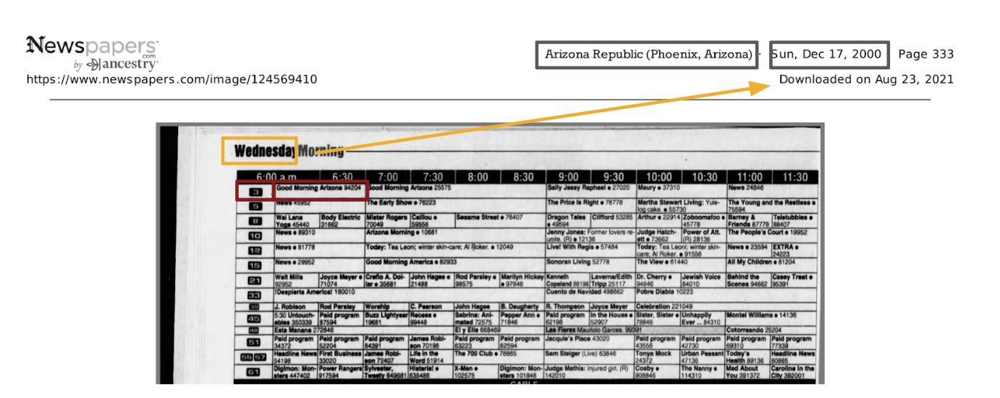
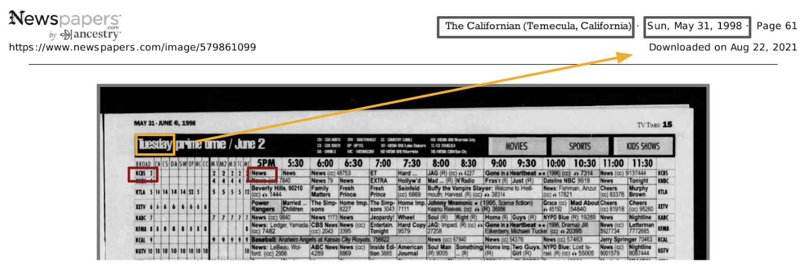

---
date:
  created: 2026-05-19
categories:
    - LLM
authors:
    - ltdarc
subtitle: 
---
# LLM Benchmarks for Researchers

For social science or business research, valuable data often remains locked inside dense, unstructured formats like PDF tables, SEC filings, or historical TV Guides. In the past, digitizing this media history required time intensive manual transcription, often relying on outsourced labor or students to go cell by cell.

While Large Language Models (LLMs) offer a powerful alternative to manual data extraction, implementing them at scale introduces a new set of challenges.

For researchers, this raises a more fundamental question: how do you know a model is reliable enough for your specific documents and research question? Strong results on one example aren't enough. You need a structured way to measure whether a model performs consistently before building any analysis on its output.

<!-- more -->

!!! note
    This article will cover how to design LLM benchmarks for research related data extraction and provide examples from our own implementation. For additional context you can reference our [Hub How-To](https://gsbresearchhub.stanford.edu/training-workshops){target="_blank"}  and our GitHub [here](https://github.com/gsbdarc/LLM_benchmarks){target="_blank"}.

## Designing Benchmarks

### Why You Need a Benchmark

Anecdotal success doesn't cut it when evaluating LLMs for data extraction. A model might extract data perfectly from a single document but this doesn't account for variability in layout, font size, and resolution across the entire dataset.

To navigate these variables, you need a benchmark: a standardized measure of how different LLMs perform specific tasks across a representative sample of your data.

For our LLM evaluation pipeline, one benchmark asked the model to extract the newspaper name from a fixed header — a straightforward task with a consistent, verifiable answer. A harder benchmark asked for the first program listed in a TV Guide grid, requiring the model to read small, low-resolution text with significant variability across documents. Covering a range of difficulty reveals not just whether a model performs well on average, but where it starts to break down.

By establishing fixed criteria, a benchmark allows researchers to:

- **Navigate Tradeoffs**: Systematically balance budget constraints against accuracy requirements.
- **Remove Bias**: Guarantee objective, reproducible results rather than relying on a few lucky outputs.
- **Track Progress**: Confidently measure whether a prompt tweak or model switch actually improves performance or causes a regression.

### Evaluation Framework

Popular LLM benchmarks like MMLU or BIG-Bench compare models at a high level, but they don't tell you whether a model can handle your specific documents or research question. For domain-specific extraction, you need to design your own.

The framework I used has four components; in a well-designed benchmark, each follows from the last.

**Research Question**

The research question anchors the entire framework. Everything downstream (what you extract, how you prompt, how you score) should trace back to it.

For our LLM evaluation pipeline, a research question might have been: *How did historical TV programming vary across channels and time periods?*

**Task**

A task translates the research question into a concrete extraction operation. One research question may require several tasks; each should be narrow enough to prompt clearly and score objectively.

For our LLM evaluation pipeline, one task was to extract the name of the first program listed in the grid — a consistent, well-defined data point across every guide in the dataset.

**Prompt**

The prompt translates the task into explicit, machine-readable instructions. Precision matters: a vague prompt doesn't just produce inconsistent outputs, it makes it harder to diagnose whether poor results reflect a model limitation or an underspecified instruction.

For our LLM evaluation pipeline, the prompt needed to specify where in the grid to look and what exactly to return. You can see how it evolved across three versions in the [Updating Prompts](#updating-prompts) section below.

**Metric**

The metric defines what counts as a correct answer, and the choice has real consequences for how you interpret results.

For our LLM evaluation pipeline, the metric scored whether the extracted title matched the ground truth. But this raises a practical question: should you use exact string matching or fuzzy matching? Exact match penalizes minor differences like trailing punctuation or capitalization that may not matter for the research question. Fuzzy matching (using Levenshtein distance or a similarity ratio) is more forgiving but requires a threshold for what counts as close enough. We started with exact matching and later pivoted to fuzzy matching to better capture closeness between model output and ground truth — small transcription differences were acceptable, but exact match was penalizing outputs that were substantively correct.

**The Feedback Loop**

In practice, this framework is iterative, not linear. Poor scores are a diagnostic signal, not just a verdict on the model. Trace back through the framework to find where alignment broke down:

- Are your tasks reflective of your research question and the data you have to work with?
- Does your prompt properly explain what you want the LLM to do?
- Is your metric appropriate for what the prompt is actually asking?

In our LLM evaluation pipeline, a one-sentence first-program prompt returned poor results; iterating on it significantly improved performance across models. Without a reusable pipeline, every prompt change means re-running each model against every image and re-scoring all results from scratch — at the scale of this project (18 models, 35 images, 6 benchmarks), that's nearly 3,800 task combinations per iteration. A reusable pipeline turns a prompt change into a configuration update, which is why the execution infrastructure covered in the next section is worth the upfront investment.

### Executing at Scale

To handle this scale efficiently, we built the following pipeline:

After configuring our inputs (benchmarks, models, and images) and preprocessing images (converting PDFs to greyscale PNGs) we accessed models through the Stanford Playground API. Outputs and benchmark evaluation results were stored in MongoDB, our centralized database. 

Storing results means you can compare across runs: did the new prompt do better or worse than the last version? Did switching models cause a regression on a benchmark that was previously working? Without it, there is no easy way to answer those questions without re-running everything from scratch. 

We processed all tasks in a few hours using the [Yen](https://rcpedia.stanford.edu/_getting_started/how_access_yens/?h=yens){target="_blank"} servers  for compute and [SLURM](https://rcpedia.stanford.edu/_user_guide/slurm/?h=slurm){target="_blank"} array jobs to process tasks in parallel.

!!! note "Stanford AI Playground"
    We used the Stanford AI Playground because it gave us access to multiple multimodal models through a single Stanford managed API. The playground is approved for [high risk](https://uit.stanford.edu/news/stanford-ai-playground-now-approved-high-risk-data){target="_blank"} data. Stanford provides access through a Stanford-managed environment with vendor agreements covering data use, retention, and model training; data is not used to train vendor models.

    You will need to apply and get approval for an [API](https://uit.stanford.edu/service/ai-api-gateway){target="_blank"} key.

    Note: models are continuously deprecated and added to the Playground. You must reapply for a new key each time this occurs in order to keep your access up to date.

## In Practice: Iterating on Historical TV Guides

As part of my intern project, I applied this framework to evaluate how well LLMs performed on a set of data extraction benchmarks for historical TV guides. Our images came from a previous project the team did for a professor. The TV guides served as proxies for other tabular historical documents (census records, financial ledgers, etc.) because they were dense, grid-based, and had mixed resolutions.

### Selecting Benchmarks

We selected tasks with clear, verifiable answers: outputs that could be checked against a hand-transcribed reference without subjective judgment. We also assigned each a difficulty level based on how challenging the extraction was expected to be, a prediction our results later confirmed. We started with six benchmarks:

=== "Easy (Grey)"

    | Task | Description |
    |---|---|
    | Newspaper Name | Simple metadata extraction, fixed location across documents, high resolution. |
    | Newspaper Date | Simple metadata extraction, fixed location across documents, high resolution. |

=== "Medium (Yellow) "

    | Task | Description |
    |---|---|
    | TV Guide Day of Week | Varied location, mixed resolution, data found in scanned PDF. |
    | TV Guide Date | Reasoning: answer is derived by combining both Newspaper Date and TV Guide Day of Week without being explicitly prompted. |

=== "Hard (Red)"

    | Task | Description |
    |---|---|
    | First Channel | Data found within grid, smallest font, lowest resolution, variability (color, placement, size). |
    | First Program | Data found within grid, smallest font, lowest resolution, variability (color, placement, size). |

### Challenges with "Ground Truth"

One of the biggest roadblocks we ran into was coming up with a standardized "ground truth" across all of the guides in our dataset. What made it challenging was how dependent it was on the specific research question and data that we were working with.

To better illustrate this challenge, when asking an LLM to extract the "first program" from the above, what is the correct answer?

- **A.** 2015 Daytona 500 The 57th running of the event. The race consists of 200 laps and is the first race of the season. (N) (cc)
- **B.** 2015 Daytona 500 The 57th running of the event. The race consists of 200 laps and is the first race of the season.
- **C.** 2015 Daytona 500

The so called "right" answer depends on whether the research question cares about close captioning, episode descriptions, or just the title.

!!! tip
    Hand transcribing 5 to 10 images yourself can be enormously helpful in understanding the data that is available and how much variability you might be dealing with.

### Updating Prompts

With ground truth defined, our scores became the signal for iteration. One benchmark that models initially struggled with was extracting the first program name — the hardest task in the set, with small font, low resolution, and significant variability across guides.

We used our metrics as a signal and adjusted our prompt several times to see if we could get better results. You can see the prompts we used below and how each model performed across all images.

=== "First Program v1"
    **Short, one sentence prompt.**

    Return the name of the program for the first channel listed and for the earliest time slot shown.

    
=== "First Program v2"
    **Added explicit grid structure and step-by-step navigation instructions.**

    Analyze the provided image of a TV schedule grid. Channels are typically listed vertically (rows) and time slots horizontally (columns). Your task is to extract the program title for the FIRST channel listed at the EARLIEST time slot shown. Follow these steps carefully: 1. Scan the grid to identify the top-most row containing programming data (the row immediately below the time-slot or any other subsection headers). 2. Scan to the left-most time block within that specific row. 3. Identify the text inside this top-leftmost program block. 4. Transcribe the text exactly as printed. Include all numbers (e.g., episode numbers, parts, movie years), abbreviations, and characters that appear immediately with the title.

    

    *gpt-5 and gpt-5-mini returned 0% on this version. Under fuzzy matching, even a hallucination produces some character overlap and scores above zero — exactly 0% means the model returned null. Likely causes: the target text was too small or low-resolution to read, or the model opted not to respond when uncertain rather than attempt an extraction.*
=== "First Program v3"
    **Narrowed the output to the title only, filtering out metadata like captions and codes.**

    Analyze the provided image of a TV schedule grid. Channels are typically listed vertically (rows) and time slots horizontally (columns). Your task is to extract the program title for the FIRST channel listed at the EARLIEST time slot shown. Follow these steps carefully: 1. Scan the grid to identify the top-most row containing programming data (the row immediately below the time-slot or any other subsection headers). 2. Scan to the left-most time block within that specific row. 3. Identify the text inside this top-leftmost program block. 4. Return only the title, ignore all closed captioning markers, rerun indicators, movie release years, or VCR Plus+ codes (numeric sequences) that appear immediately with the title.

    

## Takeaways:

Looking back on my project, the major accomplishments can be summarized into two categories:

1. **Speed and Ease**

    The pipeline design allowed us to easily add new models, benchmarks, or images. It processed tasks in parallel, stored results in a database, and calculated metrics dynamically. This framework can be adapted by any researcher looking to evaluate LLMs for structured document extraction.

2. **Quality of results**

    Above anything else, good results came from a well-defined research question and a solid understanding of the variability and outliers in our data. Only from there could we create tasks, build prompts, and choose the right metrics.

