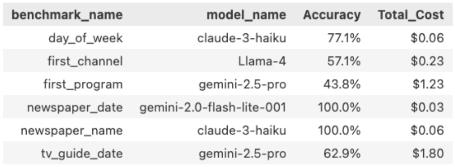

---
date:
  created: 2026-05-19
categories:
    - LLM
authors:
    - ltdarc
subtitle: 
---
# LLM Benchmarks for Researchers

For social science or business research, valuable data often remains locked inside dense, unstructured formats like PDF tables, SEC filings, or historical TV Guides. In the past, digitizing this media history required time intensive manual transcription, often relying on outsourced labor or students to go cell by cell.

While Large Language Models (LLMs) offer a powerful alternative to manual data extraction, implementing them at scale introduces a new set of challenges.

!!! note
    This article will cover how to design LLM benchmarks for research related data extraction and provide examples from our own implementation. For additional context you can reference our [Hub How-To](https://gsbresearchhub.stanford.edu/training-workshops){target="_blank"}  and our GitHub [here](https://github.com/gsbdarc/LLM_benchmarks){target="_blank"}.

## Designing Benchmarks

Designing an LLM Evaluation Framework is a systematic way of testing how accurately different AI models can complete a specific task. For researchers, it is an essential part of the AI workflow.

### Why You Need a Benchmark

Anecdotal success doesn't cut it when evaluating LLMs for data extraction. A model might extract data perfectly from a single document but this doesn't account for variability in layout, font size, and resolution across the entire dataset.

To navigate these variables, you need a benchmark: a standardized measure of how different LLMs perform specific tasks across a representative sample of your data.

Example of benchmark results:

By establishing fixed criteria, a benchmark allows researchers to:

- **Navigate Tradeoffs**: Systematically balance budget constraints against accuracy requirements.
- **Remove Bias**: Guarantee objective, reproducible results rather than relying on a few lucky outputs.
- **Track Progress**: Confidently measure whether a prompt tweak or model switch actually improves performance or causes a regression.

### Evaluation Framework

In order to ensure that our benchmarks are relevant to our research questions the following framework should be followed:

- **Research Question**: What is the fundamental academic or business question you are trying to answer?
- **Tasks**: What types of data extraction do we need to answer our question?
- **Prompt**: How do we translate this task into explicit, machine-readable instructions?
- **Metric**: How do we score the output based on what the prompt is asking our model to do?

In this way if (1) the task reflects the research question, (2) the prompt reflects the task, and (3) the metrics reflect the prompt then the metric becomes an important signal for the workflow.

**Questions to ask when results are poor:**

1. Are my tasks reflective of my research question and the data I have to work with?

2. Does my prompt properly explain what I want the LLM to do?

3. Is my metric appropriate for the actual prompt?

### Executing at Scale

Evaluating LLMs can scale quickly: testing 18 models against 35 images for 6 unique benchmarks results in nearly 3,800 unique task combinations.

In order to handle this efficiently we built out the following pipeline:

After configuring our inputs (benchmarks, models, and images) and preprocessing images (converting PDFs to greyscale PNGs) we accessed models through the Stanford Playground API. Outputs and benchmark evaluation results were stored in MongoDB, our centralized database. 

We processed all tasks in a few hours using the [Yen](https://rcpedia.stanford.edu/_getting_started/how_access_yens/?h=yens){target="_blank"} servers  for compute and [SLURM](https://rcpedia.stanford.edu/_user_guide/slurm/?h=slurm){target="_blank"} array jobs to process tasks in parallel.

!!! note "Stanford AI Playground"
    We used the Stanford AI Playground because it gave us access to multiple multimodal models through a single Stanford managed API. The playground is approved for [high risk](https://uit.stanford.edu/news/stanford-ai-playground-now-approved-high-risk-data){target="_blank"} data and information sent to the API does not leave Stanford's premises.

    You will need to apply and get approval for an [API](https://uit.stanford.edu/service/ai-api-gateway){target="_blank"} key.

    Note: models are continuously deprecated and added to the Playground. You must reapply for a new key each time this occurs in order to keep your access up to date.

## In Practice: Iterating on Historical TV Guides

As part of my intern project I evaluated how well LLMs did on a set of data extraction benchmarks for historical TV guides. Our images came from a previous project the team did for a professor. The TV guides served as proxies for other tabular historical documents (census records, financial ledgers, etc.) because they were dense, grid-based, and had mixed resolutions.

### Updating Prompts

One of the benchmarks that the models intially struggled with was extracting the name of the first program that appeared in the guide. We considered this a hard task because it was often the smallest font and lowest resolution within the TV guide grid. There was also additional variability in size, resolution, and color across the guides.

We used our metrics as a signal and adjusted our prompt several times to see if we could get better results. You can see the prompts we used below and how each model performed across all images.

=== "v1"
    **Short, one sentence prompt.**

    Return the name of the program for the first channel listed and for the earliest time slot shown.

    
=== "v2"
    **Added explicit grid structure and step-by-step navigation instructions.**

    Analyze the provided image of a TV schedule grid. Channels are typically listed vertically (rows) and time slots horizontally (columns). Your task is to extract the program title for the FIRST channel listed at the EARLIEST time slot shown. Follow these steps carefully: 1. Scan the grid to identify the top-most row containing programming data (the row immediately below the time-slot or any other subsection headers). 2. Scan to the left-most time block within that specific row. 3. Identify the text inside this top-leftmost program block. 4. Transcribe the text exactly as printed. Include all numbers (e.g., episode numbers, parts, movie years), abbreviations, and characters that appear immediately with the title.

    
=== "v3"
    **Narrowed the output to the title only, filtering out metadata like captions and codes.**

    Analyze the provided image of a TV schedule grid. Channels are typically listed vertically (rows) and time slots horizontally (columns). Your task is to extract the program title for the FIRST channel listed at the EARLIEST time slot shown. Follow these steps carefully: 1. Scan the grid to identify the top-most row containing programming data (the row immediately below the time-slot or any other subsection headers). 2. Scan to the left-most time block within that specific row. 3. Identify the text inside this top-leftmost program block. 4. Return only the title, ignore all closed captioning markers, rerun indicators, movie release years, or VCR Plus+ codes (numeric sequences) that appear immediately with the title.

    

### Challenges with "Ground Truth"

One of the biggest roadblocks we ran into was coming up with a standardized "ground truth" across all of the guides in our dataset. What made it challenging was how dependent it was on the specific research question and data that we were working with.

To better illustrate this challenge, when asking an LLM to extract the "first program" from the above, what is the correct answer?

- **A.** 2015 Daytona 500 The 57th running of the event. The race consists of 200 laps and is the first race of the season. (N) (cc)
- **B.** 2015 Daytona 500 The 57th running of the event. The race consists of 200 laps and is the first race of the season.
- **C.** 2015 Daytona 500

The so called "right" answer depends on whether the research question cares about close captioning, episode descriptions, or just the title.

!!! tip
    Hand transcribing 5 to 10 images yourself can be enormously helpful in understanding the data that is available and how much variability you might be dealing with.

## Learnings

Looking back on my project, the major accomplishments can be summarized into two categories:

1. **Speed and Ease**

    The pipeline design allowed us to easily add new models, benchmarks, or images. Tasks were able to be processed in parallel, results were stored directly in a database, and metrics were calculated dynamically. This framework can be adapted by any researcher looking to evaluate LLMs for structured document extraction.

2. **Quality of results**

    Above anything else, good results came from a well-defined research question and a solid understanding of the variability and outliers in our data. Only from there could we create tasks, build prompts, and choose the right metrics.

